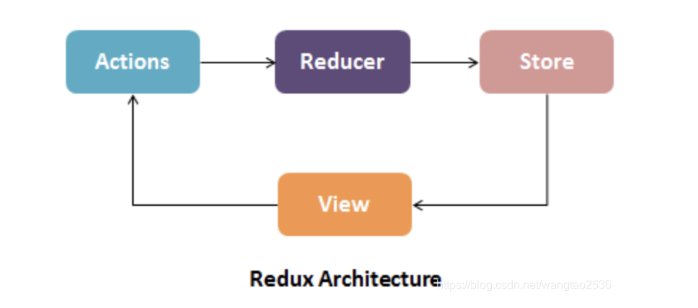
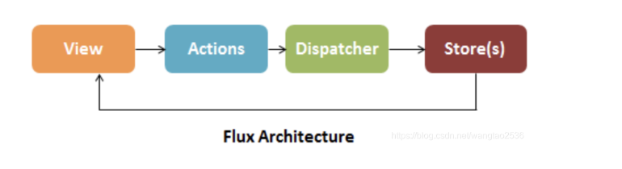
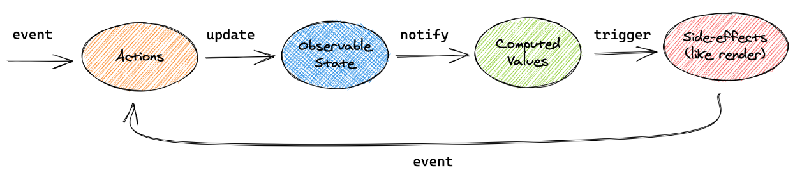

# react项目中常用的状态管理方案：


## redux 

### Store
存储应用 state 以及用于触发 state 更新的 dispatch 方法等，单一的 Store 。
Store 中提供了几个 API :
store.getState(): 获取当前 state。
store.dispatch(action): 用于 View 发出 Action。
store.subscribe(listener): 设置监听函数，一旦 state 变化则执行该函数（若把视图更新函数作为 listener 传入，则可触发视图自动渲染）。


### Reducer
是一个用来改变 state 的纯函数，传入state 通过应用状态与 Action 推导出新的 state。

### Action 同 Flux 中的 Action
dispatch方法，提交action 对象，Action 对象包含 type（类型） 和 payload （传递参数）。


### Redux 的特点
单向数据流
单一数据源 ，只有一个 Store 和 Vuex 一样
state 是只读的，每次状态更新后返回一个新的 state
和 Flux 相比，没有 Dispatcher ，但是 Store中集成了 dispatch 方法，该方法是 View 发出 Action的唯一途径。




#### redux中间件使用

```
import createSagaMiddleware from 'redux-saga';
import { createStore, applyMiddleware } from 'redux';
import thunk from 'redux-thunk';
import rootReducer from './reducers';
import rootSaga from './sagas';
 
const sagaMiddleware = createSagaMiddleware();
 
const store = createStore(rootReducer, applyMiddleware(thunk,sagaMiddleware));
 
sagaMiddleware.run(rootSaga);
```

#### redux中间件  ： redux-thunk

```
function fetchData() {
  return function(dispatch) {
    return fetch('https://api.example.com/data')
      .then(response => response.json())
      .then(data => dispatch({ type: 'FETCH_DATA_SUCCESS', data }))
      .catch(error => dispatch({ type: 'FETCH_DATA_FAILURE', error }));
  }
}
```


#### redux中间件  ： redux-saga

```
import { put, takeEvery } from 'redux-saga/effects';
import { FETCH_DATA, fetchDataSuccess, fetchDataFailure } from './actions';
 
function* fetchData() {
  try {
    const response = yield fetch('https://api.example.com/data');
    const data = yield response.json();
    yield put(fetchDataSuccess(data));
  } catch (error) {
    yield put(fetchDataFailure(error));
  }
}
 
function* watchFetchData() {
  yield takeEvery(FETCH_DATA, fetchData);
}
 
export default function* rootSaga() {
  yield all([
    watchFetchData()
  ]);
}
```


## flux
### Action
即数据改变的消息对象（可以通过事件触发、或者测试用例触发等），同样 Store 只能通过 Action 进行修改，具体 Action 的处理逻辑一般放在 Store中，Action 对象包含 type（类型） 和 payload （传递参数）。

### Dispatcher
dispatcher 就像是一个中转站，收到 View 的 Action 然后转发给 Store

### Store
数据层，存放应用状态与更新状态的方法，一旦发生改变就提醒 View 更新页面

### Flux 的特点
单向数据流
Store 可以有多个
Store 不仅存放数据，还封装了处理数据的方法





## mobx


### Actions
动作，和前面的类似，也是用于改变 State

### State
驱动应用的数据

### Computed values
计算值，但你创建一个基于当前状态的值需要使用 computed

### Reactions
当前状态改变时自动发生。

### MobX的特点
基于面向对象
局部精确更新，只有用到的数据才会引发绑定；
代码入侵性小
往往是多个 Store
大型项目使用 MobX 会使得代码不方便维护，一般用于中小型项目





# 项目当中使用到的状态管理
### dva.js 实际就是redux, react-redux, react-saga // 清分,支付

1，定义 Model
dva 通过 model 的概念把一个领域的模型管理起来，包含同步更新 state 的 reducers，处理异步逻辑的 effects，订阅数据源的 subscriptions 。

新建 model models/products.js ：
```
export default {
  namespace: 'products',
  state: [],
  reducers: {
    'delete'(state, { payload: id }) {
      return state.filter(item => item.id !== id);
    },
  },
};
```
这个 model 里：
namespace 表示在全局 state 上的 key
state 是初始值，在这里是空数组
reducers 等同于 redux 里的 reducer，接收 action，同步更新 state


2，在 index.js 里载入model
```
  app.model(require('./models/products').default);
```

3, 组件中使用 connect 链接对应的 model,可以多个
 dva 提供了 connect 方法。如果你熟悉 redux，这个 connect 就是 react-redux 的 connect 。
```
import React from 'react';
import { connect } from 'dva';
import ProductList from '../components/ProductList';

const Products = ({ dispatch, products }) => {
  function handleDelete(id) {
    dispatch({
      type: 'products/delete',
      payload: id,
    });
  }
  return (
    <div>
      <h2>List of Products</h2>
      <ProductList onDelete={handleDelete} products={products} />
    </div>
  );
};

// export default Products;
export default connect(({ products }) => ({
  products,
}))(Products);

```


### unstated-next // 调账平台

React轻量状态管理库 unstated-next 使用教程
1.安装
```
npm install --save unstated-next 或者 yarn add unstated-next
```
2.创建一个container
```
import { useState, useCallback } from "react"
import { createContainer } from "unstated-next"

function useCounter(initialState = 0) {
   let [count, setCount] = useState(initialState)

   let decrement = useCallback(() => setCount(count => count - 1), [])
   let increment = useCallback(() => setCount(count => count + 1), [])

   return { count, decrement, increment }
}

let CounterContainer = createContainer(useCounter)
export default CounterContainer
```
3.使用container
```
import CounterContainer from '../state/CounterContainer'
let counter = CounterContainer.useContainer()
import CounterContainer from '../state/CounterContainer'

export default function Counter() {
    let counter = CounterContainer.useContainer()
    console.log('Counter page render')
    return (
        <div>
            <button onClick={counter.decrement}>-</button>
            <span>{counter.count}</span>
            <button onClick={counter.increment}>+</button>
        </div>
    )
}
```
4.使用Provider包裹
导入Container
```
import CounterContainer from '../state/CounterContainer'
<xxxx.Provider></xxxx.Provider>和initialState是固定写法


xxx.Provider></xxxx.Provider>和initialState是固定写法
//初始化数据initialState，一定是这个变量名initialState
<CounterContainer.Provider initialState={10}>
    <CounterPage />
 </CounterContainer.Provider>
```

5.多层嵌套问题
当有多个Container Provider时，会有不断嵌套的问题
```
<Container1.Provider>
   <Container2.Provider>
     <Container3.Provider>
         MyApp
     </Container3.Provider>
   </Container2.Provider>
</Container1.Provider>
```

6.解决方法
```
function compose(...containers) {
  return function Component(props) {
    return containers.reduceRight((children, Container) => {
      return <Container.Provider>{children}</Container.Provider>
    }, props.children)
  }
}

let Provider = compose(Container1, Container2,Container1)

<Provider >
    myApp
</Provider>
```


### @umi/max 内置了数据流管理插件，@umijs/plugin-model，它是一种基于 hooks 范式的轻量级数据管理方案 
### // 模型分析中 使用了初始化model, 但没有单独写出应用model,还是用useState来管理数据的。
```
import { useModel } from 'umi';
 
export default function Page() {
  const { initialState, loading, error, refresh, setInitialState } =
    useModel('@@initialState');
  return <>{initialState}</>;
};
```


1，创建 Model
```
// src/models/counterModel.ts
import { useState, useCallback } from 'react';
 
export default function Page() {
  const [counter, setCounter] = useState(0);
 
  const increment = useCallback(() => setCounter((c) => c + 1), []);
  const decrement = useCallback(() => setCounter((c) => c - 1), []);
 
  return { counter, increment, decrement };
};
```

```
// src/models/userModel.ts
import { useState } from 'react';
import { getUser } from '@/services/user';
 
export default function Page() {
  const [user, setUser] = useState({});
  const [loading, setLoading] = useState(true);
 
  useEffect(() => {
    getUser().then((res) => {
      setUser(res);
      setLoading(false);
    });
  }, []);
 
  return {
    user,
    loading,
  };
};
```
2，使用 Model , useModel() 方法传入的参数为 Model 的命名空间。
```
// src/components/Username/index.tsx
import { useModel } from 'umi';
 
export default function Page() {
  const { user, loading } = useModel('userModel');
 
  return (
    {loading ? <></>: <div>{user.username}</div>}
  );
}
```


