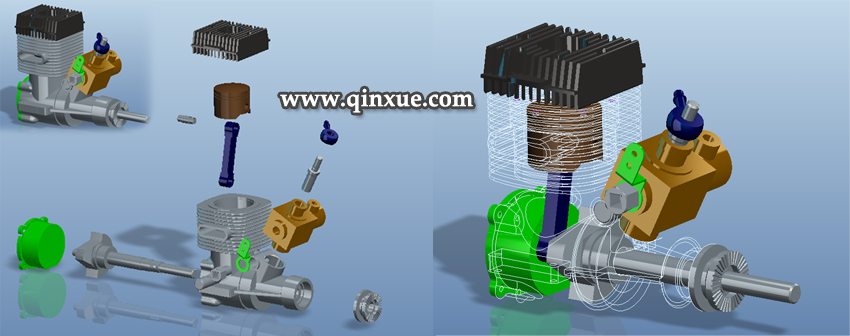
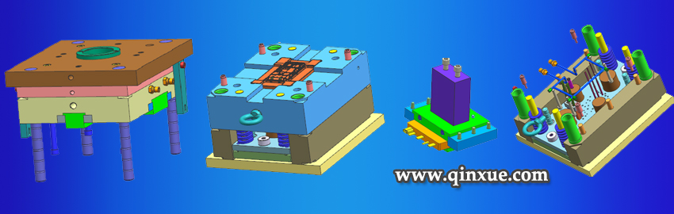

## 学习背景
机械设计用的3D软件 UG , Pro/E ,用于机械方面的零件设计，装配，模具，数控等
- ugnx的图片
 
- proE的图片
 

## 什么是web3D技术？

网页3D技术目前主要是指的是使用webgl的方式，达到在网页中呈现3D场景的技术。其实之前在网页上呈现3D内容很多是由flash技术来实现的，但是由于flash平台的落寞以及webgl的兴起，目前主流的网页3d呈现主要是由webgl来完成。webgl是OpenGL es的子集，也就是说webgl其实是opengl的裁剪版本。图形渲染是一个比较大的话题，展开来讲有非常非常多的内容，楼主如果想学习还是要系统的看下。如果只是了解科普的话可以看看常见的一些库，比如使用最广泛的Three.js，以及非常不错的后起只秀Babylon.js.。他们的官方示例里面都有很大3D展示相关的demo，目前webgl的应用常见主要是3D的展示，AR VR应用，家装、Bim、Gis产业以及游戏营销。总的来说web上的3D展示的视觉震撼还是要大于普通2d图片的。

## 什么是webgl ?

WebGL（全写Web Graphics Library）是一种3D绘图协议，这种绘图技术标准允许把JavaScript和OpenGL ES 2.0结合在一起，通过增加OpenGL ES 2.0的一个JavaScript绑定，WebGL可以为HTML5 Canvas提供硬件3D加速渲染，这样Web开发人员就可以借助系统显卡来在浏览器里更流畅地展示3D场景和模型了，还能创建复杂的导航和数据视觉化。显然，WebGL技术标准免去了开发网页专用渲染插件的麻烦，可被用于创建具有复杂3D结构的网站页面，甚至可以用来设计3D网页游戏等等。

WebGL 是一种 JavaScript API，用于在不使用插件的情况下在任何兼容的网页浏览器中呈现交互式 2D 和 3D 图形。WebGL 完全集成到浏览器的所有网页标准中，可将影像处理和效果的 GPU 加速使用方式当做网页 Canvas 的一部分。WebGL 元素可以加入其他 HTML 元素之中并与网页或网页背景的其他部分混合。

WebGL 程序由 JavaScript 编写的句柄和 OpenGL Shading Language（GLSL）编写的着色器代码组成，该语言类似于 C 或 C++，并在电脑的图形处理器（GPU）上运行。WebGL 由非营利 Khronos Group 设计和维护。

- webgl 历史

WebGL起源于Mozilla员工弗拉基米尔·弗基西维奇的一项称为Canvas 3D实验项目。2006年，弗基西维奇首次展示了Canvas 3D的原型。2007年底在Firefox和Opera被实现。
在2009年初，非营利技术联盟Khronos Group启动了WebGL的工作组，最初的工作成员包括Apple、Google、Mozilla、Opera等。2011年3月发布WebGL 1.0规范。截至2012年3月，工作组的主席由肯·罗素（Ken Russell，全名“Kenneth Bradley Russell”）担任。
WebGL的早期应用包括Zygote Body。
WebGL2规范的发展始于2013年，并于2017年1月完成。该规范基于OpenGL ES 3.0。首度实现在Firefox 51、Chrome 56和Opera 43中。

- webgl 中文网 http://www.hewebgl.com/

## 什么是three.js
three.js是JavaScript编写的WebGL第三方库。提供了非常多的3D显示功能。Three.js 是一款运行在浏览器中的 3D 引擎，你可以用它创建各种三维场景，包括了摄影机、光影、材质等各种对象。

- three.js官网 https://threejs.org/

## openGL,webgl,three.js的关系
openGL是一个跨平台3D/2D的绘图标准，WebGL则是openGL在浏览器上的一个实现。
web前端开发人员可以直接用WebGL接口进行编程，但WebGL只是非常基础的绘图API，需要编程人员有很多的数学知识、绘图知识才能完成3D编程任务，而且代码量巨大。
Threejs对WebGL进行了封装，让前端开发人员在不需要掌握很多数学知识和绘图知识的情况下，也能够轻松进行web 3D开发，降低了门槛，同时大大提升了效率。

-学习博客 ： http://www.wjceo.com/

### webgl学习
 先看lib里面的思维导图， 重点在于 顶点着色器 ，片元着色器 ，openGl的数据类型

 再看下webgl下三个html文件，了解程序运行。

 ### three.js学习
 - 引入vue
 vue 中引入 : yarn add three three-orbitcontrols dat.gui tween.js

 先看lib里面的思维导图，了解大概的程序结构

 ## 重点在于五要素 （场景-scene，相机-camera，光-light ，物体, 渲染器-renderer）
  
 
 - 场景
   three.js 采用的是右手坐标系
    

 - 相机
   相机有正交投影相机和透视投影相机两种。透视投影跟人眼看到的世界是一样的，近大远小；正交投影则远近都是一样的大小，三维空间中平行的线，投影到二维空间也一定是平行的。大部分场景都适合使用透视投影相机，因为跟真实世界的观测效果一样；在制图、建模等场景适合使用正交投影相机，方便观察模型之间的大小比例。

   Threejs中的相机跟真实世界的相机不完全一样，这里相机的可见区域是一个立方体，称为相机的示景体。
   正交投影相机
     
   透视投影相机
     

 - 物体
   - 形状
   物体由几何形状（Geometry）和材质（Material）组成。同样的几何形状，不同材质构成了不同物体，比如球状，有篮球、玻璃球、水晶球等。
   - 材质
   Threejs提供了几种比较有代表性的材质，常用的有漫反射、镜面反射两种材质，还可以引入外部图片，贴到物体表面，称为纹理贴图。

 - 渲染器
   renderer
   动画渲染时，使用requestAnimationFrame，让浏览器自行根据当前cpu负载等情况决定何时重绘，达到最佳帧率。

   ## vue + three.js 项目初始化

   

 

